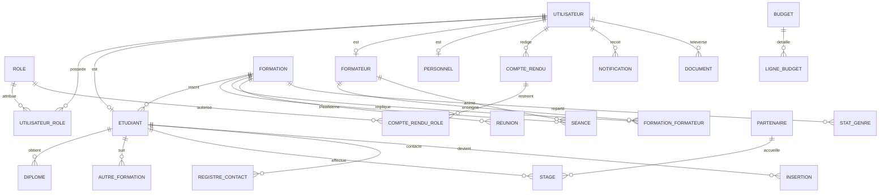

# Schéma de base de données (PostgreSQL)

Base relationnelle pour l'application de gestion administrative et pédagogique.
SGBD cible : **PostgreSQL 16**. Nommage : tables et colonnes en `snake_case`, pluriel pour les tables.

> **Source de vérité runtime** : migrations Flyway dans `platform-be/gap-app/src/main/resources/db/migration/`
> (table `journal_acces_document` ajoutée en V7, liaison étudiant/utilisateur en V5).

Conventions communes à (presque) toutes les tables :
- `id BIGSERIAL PRIMARY KEY`
- `created_at TIMESTAMPTZ NOT NULL DEFAULT now()`
- `updated_at TIMESTAMPTZ NOT NULL DEFAULT now()`
- `is_deleted BOOLEAN NOT NULL DEFAULT false` (suppression logique)

---

## 1. Diagramme entité-association (ERD)



---

## 2. Domaines / modules couverts

| Domaine             | Tables                                                                                                 |
| ------------------- | ------------------------------------------------------------------------------------------------------ |
| Sécurité / Comptes  | `role`, `utilisateur`, `utilisateur_role`                                                              |
| Étudiant            | `etudiant`, `diplome`, `autre_formation`                                                               |
| Formations          | `formation`, `formateur`, `formation_formateur`, `seance`, `reunion`, `stat_genre`                     |
| Communication       | `compte_rendu`, `compte_rendu_role`, `notification`                                                    |
| Administration      | `courrier`, `note_service`, `note_administrative`, `circulaire`, `budget`, `ligne_budget`, `personnel` |
| Appui à l'insertion | `partenaire`, `stage`, `registre_contact`, `insertion`                                                 |
| Transverse          | `document`                                                                                             |

---

## 3. DDL PostgreSQL

```sql
-- =========================================================
-- 1. SECURITE / COMPTES
-- =========================================================

CREATE TABLE role (
    id          BIGSERIAL PRIMARY KEY,
    code        VARCHAR(40) NOT NULL UNIQUE,   -- ADMIN, ETUDIANT, ENSEIGNANT...
    libelle     VARCHAR(100) NOT NULL
);

CREATE TABLE utilisateur (
    id            BIGSERIAL PRIMARY KEY,
    email         VARCHAR(150) NOT NULL UNIQUE,
    mot_de_passe  VARCHAR(255) NOT NULL,        -- hash BCrypt
    nom           VARCHAR(100) NOT NULL,
    prenom        VARCHAR(100) NOT NULL,
    telephone     VARCHAR(30),
    photo_url     VARCHAR(255),
    actif         BOOLEAN NOT NULL DEFAULT true,
    created_at    TIMESTAMPTZ NOT NULL DEFAULT now(),
    updated_at    TIMESTAMPTZ NOT NULL DEFAULT now()
);

CREATE TABLE utilisateur_role (
    utilisateur_id BIGINT NOT NULL REFERENCES utilisateur(id) ON DELETE CASCADE,
    role_id        BIGINT NOT NULL REFERENCES role(id) ON DELETE CASCADE,
    PRIMARY KEY (utilisateur_id, role_id)
);

-- =========================================================
-- 2. FORMATIONS
-- =========================================================

CREATE TABLE formation (
    id                 BIGSERIAL PRIMARY KEY,
    intitule           VARCHAR(200) NOT NULL,
    type               VARCHAR(50) NOT NULL,    -- DIPLOMANTE, CERTIFIANTE, PRIVEE, CONTINUE
    niveau             VARCHAR(50),             -- LICENCE, MASTER, ...
    date_debut         DATE,
    date_fin           DATE,
    type_financement   VARCHAR(50),             -- ETAT, PRIVE, PARTENAIRE, AUTOFINANCE
    montant_financement NUMERIC(14,2),
    description        TEXT,
    created_at         TIMESTAMPTZ NOT NULL DEFAULT now(),
    updated_at         TIMESTAMPTZ NOT NULL DEFAULT now(),
    is_deleted         BOOLEAN NOT NULL DEFAULT false
);

CREATE TABLE formateur (
    id             BIGSERIAL PRIMARY KEY,
    utilisateur_id BIGINT UNIQUE REFERENCES utilisateur(id) ON DELETE SET NULL,
    type           VARCHAR(40) NOT NULL,        -- ENSEIGNANT, ENSEIGNANT_ASSOCIE, RESPONSABLE_FORMATION, TUTEUR
    specialite     VARCHAR(150),
    grade          VARCHAR(100),
    created_at     TIMESTAMPTZ NOT NULL DEFAULT now(),
    updated_at     TIMESTAMPTZ NOT NULL DEFAULT now()
);

CREATE TABLE formation_formateur (
    formation_id BIGINT NOT NULL REFERENCES formation(id) ON DELETE CASCADE,
    formateur_id BIGINT NOT NULL REFERENCES formateur(id) ON DELETE CASCADE,
    role_dans_formation VARCHAR(60),            -- TITULAIRE, ASSOCIE, TUTEUR
    PRIMARY KEY (formation_id, formateur_id)
);

CREATE TABLE stat_genre (
    id           BIGSERIAL PRIMARY KEY,
    formation_id BIGINT NOT NULL REFERENCES formation(id) ON DELETE CASCADE,
    genre        VARCHAR(10) NOT NULL,          -- HOMME, FEMME, AUTRE
    nombre       INTEGER NOT NULL DEFAULT 0,
    UNIQUE (formation_id, genre)
);

-- Emploi du temps : cours, devoir, examen
CREATE TABLE seance (
    id           BIGSERIAL PRIMARY KEY,
    formation_id BIGINT NOT NULL REFERENCES formation(id) ON DELETE CASCADE,
    formateur_id BIGINT REFERENCES formateur(id) ON DELETE SET NULL,
    matiere      VARCHAR(150) NOT NULL,
    type         VARCHAR(20) NOT NULL,          -- COURS, DEVOIR, EXAMEN
    date_seance  DATE NOT NULL,
    heure_debut  TIME NOT NULL,
    heure_fin    TIME NOT NULL,
    salle        VARCHAR(60),
    created_at   TIMESTAMPTZ NOT NULL DEFAULT now()
);

-- Réunions liées au suivi tutorat / préparation cours / préparation évaluations
CREATE TABLE reunion (
    id           BIGSERIAL PRIMARY KEY,
    formation_id BIGINT REFERENCES formation(id) ON DELETE SET NULL,
    type         VARCHAR(40) NOT NULL,          -- TUTORAT, PREPARATION_COURS, PREPARATION_EVALUATION
    objet        VARCHAR(200) NOT NULL,
    date_reunion TIMESTAMPTZ NOT NULL,
    lieu         VARCHAR(120),
    compte_rendu TEXT,
    created_at   TIMESTAMPTZ NOT NULL DEFAULT now()
);

-- =========================================================
-- 3. ETUDIANT
-- =========================================================

CREATE TABLE etudiant (
    id             BIGSERIAL PRIMARY KEY,
    ine            VARCHAR(40) NOT NULL UNIQUE,  -- Id étudiant / INE
    utilisateur_id BIGINT UNIQUE REFERENCES utilisateur(id) ON DELETE SET NULL,
    nom            VARCHAR(100) NOT NULL,
    prenom         VARCHAR(100) NOT NULL,
    date_naissance DATE,
    genre          VARCHAR(10),                  -- HOMME, FEMME, AUTRE
    email          VARCHAR(150),
    telephone      VARCHAR(30),
    formation_id   BIGINT REFERENCES formation(id) ON DELETE SET NULL,
    promo          VARCHAR(50),
    annee_debut    INTEGER,
    annee_sortie   INTEGER,
    created_at     TIMESTAMPTZ NOT NULL DEFAULT now(),
    updated_at     TIMESTAMPTZ NOT NULL DEFAULT now(),
    is_deleted     BOOLEAN NOT NULL DEFAULT false
);

CREATE TABLE diplome (
    id          BIGSERIAL PRIMARY KEY,
    etudiant_id BIGINT NOT NULL REFERENCES etudiant(id) ON DELETE CASCADE,
    intitule    VARCHAR(200) NOT NULL,
    type        VARCHAR(80),
    etablissement VARCHAR(150),
    annee       INTEGER
);

CREATE TABLE autre_formation (
    id          BIGSERIAL PRIMARY KEY,
    etudiant_id BIGINT NOT NULL REFERENCES etudiant(id) ON DELETE CASCADE,
    intitule    VARCHAR(200) NOT NULL,
    organisme   VARCHAR(150),
    annee       INTEGER
);

-- =========================================================
-- 4. COMMUNICATION
-- =========================================================

CREATE TABLE compte_rendu (
    id           BIGSERIAL PRIMARY KEY,
    titre        VARCHAR(200) NOT NULL,
    type         VARCHAR(40) NOT NULL,          -- REUNION, RENCONTRE, SEMINAIRE, WEBINAIRE, CONSEIL_UNIVERSITE
    date_event   DATE NOT NULL,
    contenu      TEXT,
    document_url VARCHAR(255),
    auteur_id    BIGINT REFERENCES utilisateur(id) ON DELETE SET NULL,
    created_at   TIMESTAMPTZ NOT NULL DEFAULT now(),
    is_deleted   BOOLEAN NOT NULL DEFAULT false
);

-- Accès au compte rendu restreint par rôle
CREATE TABLE compte_rendu_role (
    compte_rendu_id BIGINT NOT NULL REFERENCES compte_rendu(id) ON DELETE CASCADE,
    role_id         BIGINT NOT NULL REFERENCES role(id) ON DELETE CASCADE,
    PRIMARY KEY (compte_rendu_id, role_id)
);

CREATE TABLE notification (
    id             BIGSERIAL PRIMARY KEY,
    utilisateur_id BIGINT NOT NULL REFERENCES utilisateur(id) ON DELETE CASCADE,
    titre          VARCHAR(200) NOT NULL,
    message        TEXT,
    type           VARCHAR(40),                 -- COMPTE_RENDU, CIRCULAIRE, SYSTEME
    lien           VARCHAR(255),
    lu             BOOLEAN NOT NULL DEFAULT false,
    created_at     TIMESTAMPTZ NOT NULL DEFAULT now()
);

-- =========================================================
-- 5. ADMINISTRATION
-- =========================================================

CREATE TABLE courrier (
    id            BIGSERIAL PRIMARY KEY,
    type          VARCHAR(10) NOT NULL,         -- ARRIVE, DEPART
    reference     VARCHAR(80),
    objet         VARCHAR(200) NOT NULL,
    expediteur    VARCHAR(150),
    destinataire  VARCHAR(150),
    date_courrier DATE NOT NULL,
    document_url  VARCHAR(255),
    statut        VARCHAR(40) DEFAULT 'RECU',   -- RECU, TRAITE, ARCHIVE
    created_at    TIMESTAMPTZ NOT NULL DEFAULT now()
);

CREATE TABLE note_service (
    id           BIGSERIAL PRIMARY KEY,
    type         VARCHAR(10) NOT NULL,          -- INTERNE, EXTERNE
    reference    VARCHAR(80),
    objet        VARCHAR(200) NOT NULL,
    contenu      TEXT,
    document_url VARCHAR(255),
    date_note    DATE NOT NULL,
    auteur_id    BIGINT REFERENCES utilisateur(id) ON DELETE SET NULL,
    created_at   TIMESTAMPTZ NOT NULL DEFAULT now()
);

CREATE TABLE note_administrative (
    id           BIGSERIAL PRIMARY KEY,
    objet        VARCHAR(200) NOT NULL,
    contenu      TEXT,
    document_url VARCHAR(255),
    date_note    DATE NOT NULL,
    created_at   TIMESTAMPTZ NOT NULL DEFAULT now()
);

CREATE TABLE circulaire (
    id              BIGSERIAL PRIMARY KEY,
    reference       VARCHAR(80),
    objet           VARCHAR(200) NOT NULL,
    contenu         TEXT,
    document_url    VARCHAR(255),
    date_circulaire DATE NOT NULL,
    niveau          VARCHAR(60) DEFAULT 'CENTRAL',
    created_at      TIMESTAMPTZ NOT NULL DEFAULT now()
);

CREATE TABLE budget (
    id               BIGSERIAL PRIMARY KEY,
    annee            INTEGER NOT NULL,
    type             VARCHAR(20) NOT NULL,      -- PROJET, REALISE
    note_orientation TEXT,
    document_url     VARCHAR(255),
    created_at       TIMESTAMPTZ NOT NULL DEFAULT now(),
    UNIQUE (annee, type)
);

CREATE TABLE ligne_budget (
    id              BIGSERIAL PRIMARY KEY,
    budget_id       BIGINT NOT NULL REFERENCES budget(id) ON DELETE CASCADE,
    intitule        VARCHAR(200) NOT NULL,
    montant_prevu   NUMERIC(14,2) DEFAULT 0,
    montant_realise NUMERIC(14,2) DEFAULT 0
);

CREATE TABLE personnel (
    id             BIGSERIAL PRIMARY KEY,
    utilisateur_id BIGINT UNIQUE REFERENCES utilisateur(id) ON DELETE SET NULL,
    matricule      VARCHAR(60) UNIQUE,
    type           VARCHAR(20) NOT NULL,        -- ADMINISTRATIF, ENSEIGNANT, TUTEUR
    fonction       VARCHAR(150),
    date_embauche  DATE,
    created_at     TIMESTAMPTZ NOT NULL DEFAULT now()
);

-- =========================================================
-- 6. APPUI A L'INSERTION
-- =========================================================

CREATE TABLE partenaire (
    id               BIGSERIAL PRIMARY KEY,
    nom              VARCHAR(150) NOT NULL,
    type             VARCHAR(60),               -- ENTREPRISE, ONG, INSTITUTION...
    secteur          VARCHAR(120),
    contact_nom      VARCHAR(120),
    contact_email    VARCHAR(150),
    telephone        VARCHAR(30),
    adresse          VARCHAR(200),
    date_partenariat DATE,
    statut           VARCHAR(40) DEFAULT 'ACTIF',
    created_at       TIMESTAMPTZ NOT NULL DEFAULT now()
);

CREATE TABLE stage (
    id           BIGSERIAL PRIMARY KEY,
    etudiant_id  BIGINT NOT NULL REFERENCES etudiant(id) ON DELETE CASCADE,
    partenaire_id BIGINT REFERENCES partenaire(id) ON DELETE SET NULL,
    sujet        VARCHAR(200),
    date_debut   DATE,
    date_fin     DATE,
    bilan        TEXT,
    note         NUMERIC(4,2),
    created_at   TIMESTAMPTZ NOT NULL DEFAULT now()
);

CREATE TABLE registre_contact (
    id           BIGSERIAL PRIMARY KEY,
    etudiant_id  BIGINT NOT NULL REFERENCES etudiant(id) ON DELETE CASCADE,
    date_contact DATE NOT NULL,
    canal        VARCHAR(40),                   -- EMAIL, TELEPHONE, PRESENTIEL
    objet        VARCHAR(200),
    compte_rendu TEXT,
    created_at   TIMESTAMPTZ NOT NULL DEFAULT now()
);

CREATE TABLE insertion (
    id            BIGSERIAL PRIMARY KEY,
    etudiant_id   BIGINT NOT NULL REFERENCES etudiant(id) ON DELETE CASCADE,
    type          VARCHAR(30) NOT NULL,         -- AUTO_EMPLOI, EMPLOI_SALARIE, EN_RECHERCHE
    entreprise    VARCHAR(150),
    poste         VARCHAR(150),
    secteur       VARCHAR(120),
    date_insertion DATE,
    created_at    TIMESTAMPTZ NOT NULL DEFAULT now()
);

-- =========================================================
-- 7. TRANSVERSE : DOCUMENTS / IMAGES
-- =========================================================

CREATE TABLE document (
    id           BIGSERIAL PRIMARY KEY,
    nom          VARCHAR(200) NOT NULL,
    type_mime    VARCHAR(100),
    url          VARCHAR(255) NOT NULL,
    taille       BIGINT,
    module       VARCHAR(50),                   -- COMMUNICATION, ADMINISTRATION, ...
    entite_id    BIGINT,                         -- id de l'entité liée
    uploaded_by  BIGINT REFERENCES utilisateur(id) ON DELETE SET NULL,
    created_at   TIMESTAMPTZ NOT NULL DEFAULT now()
);

-- =========================================================
-- 8. INDEX UTILES
-- =========================================================

CREATE INDEX idx_etudiant_formation   ON etudiant(formation_id);
CREATE INDEX idx_seance_formation     ON seance(formation_id);
CREATE INDEX idx_seance_date          ON seance(date_seance);
CREATE INDEX idx_cr_type              ON compte_rendu(type);
CREATE INDEX idx_courrier_type        ON courrier(type);
CREATE INDEX idx_notif_user_lu        ON notification(utilisateur_id, lu);
CREATE INDEX idx_insertion_type       ON insertion(type);
```

---

## 4. Données de référence (rôles)

```sql
INSERT INTO role (code, libelle) VALUES
 ('ADMIN', 'Administrateur'),
 ('ADMINISTRATIF', 'Personnel administratif'),
 ('ENSEIGNANT', 'Enseignant'),
 ('ENSEIGNANT_ASSOCIE', 'Enseignant associé'),
 ('RESPONSABLE_FORMATION', 'Responsable de formation'),
 ('TUTEUR', 'Tuteur'),
 ('APPUI_INSERTION', 'Appui à l''insertion'),
 ('ETUDIANT', 'Étudiant');
```

> Remarque : les valeurs de type (`type`, `genre`, `statut`...) sont gérées par des
> énumérations applicatives (enum Java) plutôt que par des tables de référence, pour
> rester simple. Elles peuvent être contraintes par des `CHECK` si besoin.
